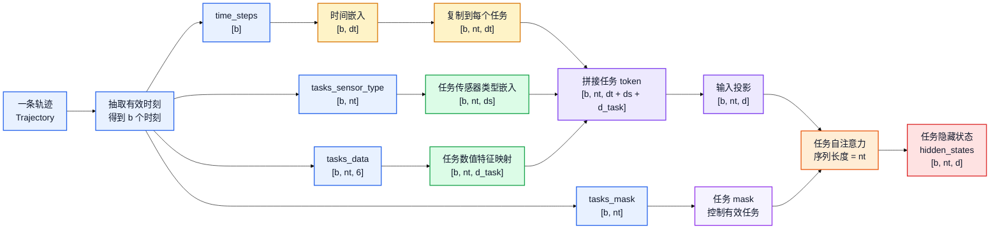
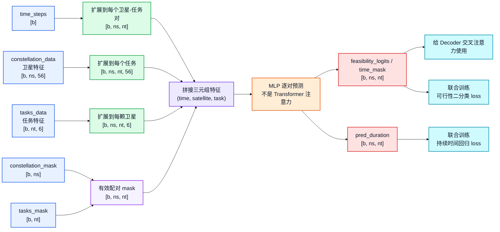
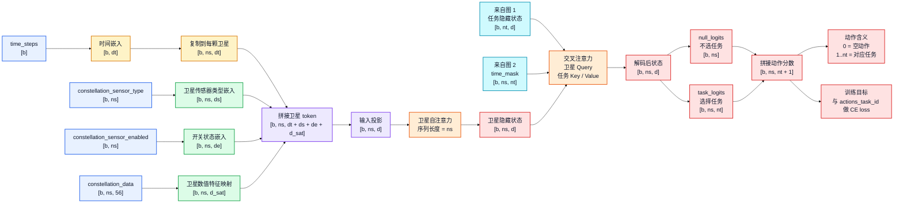

# AEOS-Former 输入输出与张量形状流图

这个文件把原来的一张大图拆成三张小图，方便查看和编辑。

符号说明：

- `b`：一批被采样出来的时刻
- `ns`：卫星数
- `nt`：当前时刻的候选任务数
- `d`：Transformer 隐藏维度
- `dt`：时间嵌入维度
- `ds`：传感器类型嵌入维度

核心结论：

- 时间不是 Transformer 的序列轴
- Encoder 把任务当序列，序列长度是 `nt`
- Decoder 把卫星当序列，序列长度是 `ns`
- TimeModel 是卫星-任务两两配对的约束模块，不是 Transformer 序列

## 图 1：Encoder，任务序列

## 图 2：TimeModel，约束模块

## 图 3：Decoder，卫星序列与动作输出

## 颜色说明

- 蓝色：原始输入
- 黄色：时间嵌入
- 绿色：特征嵌入或特征映射
- 紫色：拼接、投影、配对
- 橙色：注意力或 MLP 计算层
- 红色：输出或损失
- 青色：来自其他图的中间结果

## 简化理解

- 图 1：任务之间互相看，得到任务表示
- 图 2：每个卫星-任务对单独判断是否可行、能持续多久
- 图 3：卫星之间互相看，再去看任务，最后输出每颗卫星选哪个任务

所以它不是“时间序列 Transformer”。它是“任务序列 + 卫星序列 + 约束配对模块”的调度模型。
